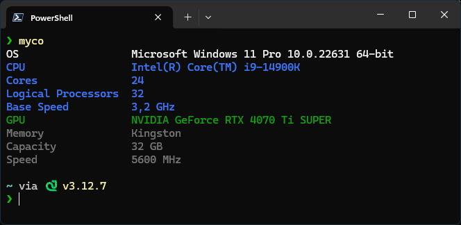

# Myco
"Myco" My computer 💻

Myco is a .NET application that uses WMI (Windows Management Instrumentation) to gather and display detailed information about your computer's hardware and operating system.



## Requirements

- .NET 9.0
- Windows x64

## Building the Project

To build the project, run the following command:

```sh
dotnet publish -c Release -r win-x64 --self-contained
```

## Running the Application

After building the project, you can run the executable from the publish directory:

```sh
./bin/Release/net9.0/win-x64/publish/Myco.exe
```

## GitHub Actions

This project uses GitHub Actions to automatically build and release the application when changes are pushed to the `main` branch.
